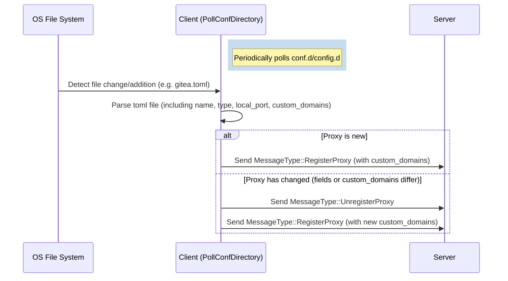

# Design Spec: Support `custom_domains` in Client Dynamic Configuration Loader

## Context & Problem Statement
The C++ Fast Reverse Proxy (`cfrp`) client supports hot-reloading configurations from a configured `conf.d` directory. Currently, while the main configuration parser supports `custom_domains` for HTTP/HTTPS type proxies, the dynamic configuration loader in [src/client/client.cpp](file:///Users/rukawaz/projects/cfrp/src/client/client.cpp) completely omits parsing `custom_domains`. Furthermore, when a dynamic configuration file changes, the change detection mechanism does not check if the custom domains have changed, which prevents dynamic reload from propagating domain updates to the server.

This design specification details the additions needed to support `custom_domains` in the dynamic config loader.

## Architecture & Data Flow


## Detailed Changes

### 1. Parsing in `Client::PollConfDirectory`
Update [src/client/client.cpp](file:///Users/rukawaz/projects/cfrp/src/client/client.cpp) to extract `custom_domains` from the parsed TOML table:

```cpp
// In Client::PollConfDirectory
if (auto domains = data["custom_domains"].as_array()) {
    for (auto& d : *domains) {
        if (auto s = d.as_string()) pc.custom_domains.push_back(s->get());
    }
} else if (auto d = data["custom_domains"].as_string()) {
    pc.custom_domains.push_back(d->get());
}
```

### 2. Change Detection in `Client::PollConfDirectory`
Update the logic that determines if a dynamic proxy has changed to include `custom_domains`:

```cpp
bool changed = (it->second.type != pc.type || 
                it->second.local_ip != pc.local_ip ||
                it->second.local_port != pc.local_port ||
                it->second.remote_port != pc.remote_port ||
                it->second.custom_domains != pc.custom_domains);
```

## Testing Plan
1. **Unit Testing / Mocking**: Verify compile safety and syntax.
2. **Integration Verification**: Create a temporary configuration file inside a `conf.d` directory, verify that the logs show the proxy adding/updating with custom domains, and check that the server receives the list of domains.
